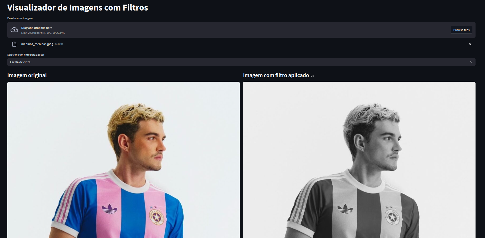

# Visualizador de Imagens com Filtros

Este projeto é uma interface desenvolvida com Streamlit que permite carregar imagens e aplicar filtros de processamento, como:

- Escala de cinza
- Inversão de cores
- Aumento de contraste
- Desfoque (Blur)
- Nitidez (Sharpen)
- Detecção de bordas (Canny)


---

## Tecnologias Utilizadas

- Streamlit
- OpenCV
- NumPy
- Pillow

---

## Como executar o projeto

### 1. Clonar o repositório

```bash
git clone https://github.com/anabeggiato/image-viewer.git
cd image-viewer
```

### 2. Criar e ativar um ambiente virtual

```bash
python -m venv venv
source venv/bin/activate  # Linux/Mac
venv\Scripts\activate      # Windows
```

### 3. Instalar as dependências

```bash
pip install -r requirements.txt
```

### 4. Executar a aplicação

```bash
streamlit run app.py
```

---


## Exemplo
<div style="text-align: center;">
  
</div>


---
